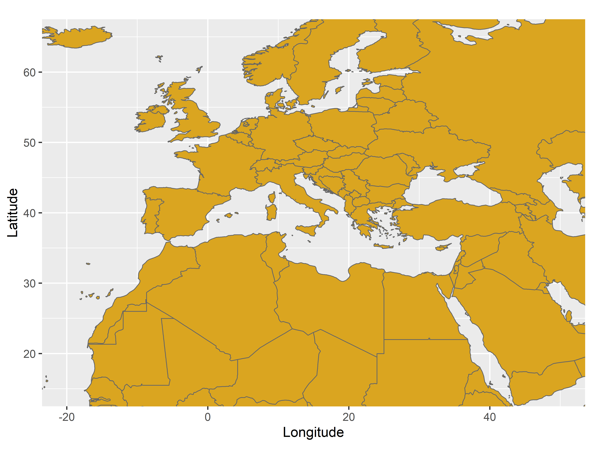
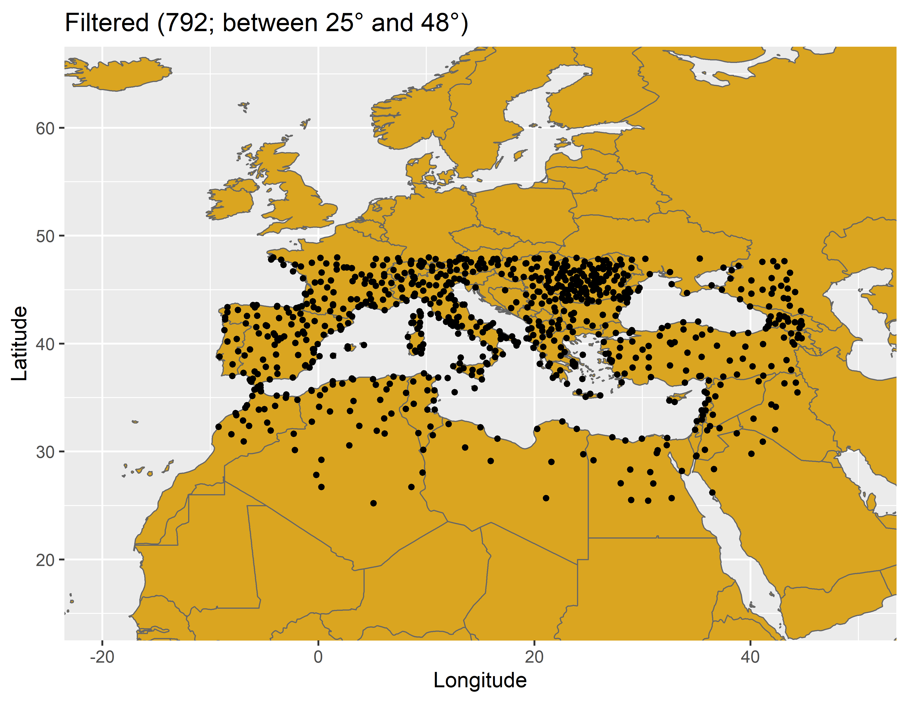

```{r, warning=FALSE, include = FALSE}
#Automatically write R package citation entries to a .bib file
knitr::write_bib(c(.packages(), 
                   'chillR',
                   'devtools',
                   'dormancyR',
                   'ggplot2'), 'packages.bib')
```

<div style="text-align: justify">

# Chill projections for the Mediterranean region

This repository contains the code and part of the data generated to assess the impacts of climate change on the Mediterranean. Our analysis is framed by the [AdaMedOr](https://twitter.com/AdaMedOr1) project.

<center>
<a></a>
</center>

Using the `chillR` package [@R-chillR], we listed 5,000 available weather stations close the Mediterranean area. These weather stations are available from the [Global Summary Of the Day (GSOD)](https://data.noaa.gov/dataset/dataset/global-surface-summary-of-the-day-gsod) database. After some filtering, we identified 792 weather stations starting the recording before 1974 and finishing after 2020 as well as located between the latitude 25° and 48°.

<center>
<a></a>
</center>

</div>

# References