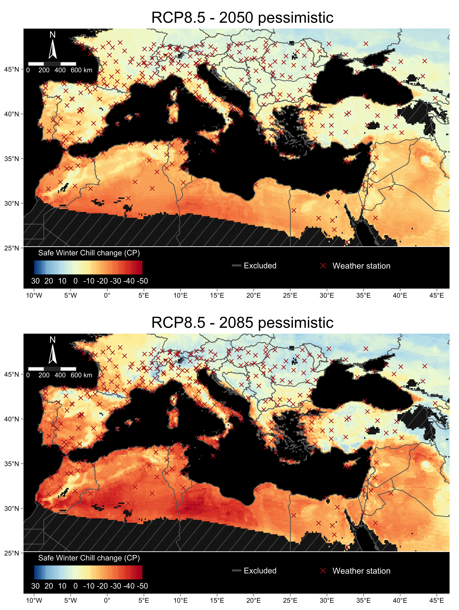

<style>
body {
text-align: justify}
</style>

```{r internal, echo = FALSE, message = FALSE}
library(kableExtra)
library(tidyverse)
```

[^*]: Corresponding author: Eduardo Fernández (efernand@uni-bonn.de)

## Introduction

In this document, we provide supplementary materials for the work 'Winter chill simulations combined with expert knowledge emphasize the vulnerability of temperate fruit orchards in the Mediterranean region' by Eduardo Fernandez and co-authors. The work is published in the journal Climatic Change under the doi: DOI. We conducted this study in collaboration with researchers from northern and southern Spain, Tunisia, Morocco and Germany under the umbrella of an international project [(AdaMedOr)](https://mel.cgiar.org/projects/adamedor) funded by the Partnership for Research and Innovation in the Mediterranean Area (PRIMA).

Compared to previous similar studies, we provide now an analysis that combines the spatial interpolation of winter chill accumulation in the Mediterranean region under future scenarios with expert's knowledge regarding the impacts of climate change on temperate orchards as well as future concerns of farmers cultivating temperate species. Our approach allowed us to frame and contextualize the results of our chill estimations, potentially contributing to the development of management strategies to adapt Mediterranean orchards to future climate conditions.

We offer figures that were not included in the main manuscript, as well as pictures of observed impacts of global warming on the development of temperate trees in Mediterranean countries. In addition, we include information about the weather stations used for the analysis.

\newpage

## Weather stations used in the analysis

For this study, we used 387 weather stations as primary source of minimum and maximum records between 1974 and 2020. In the following table (Table S1), we provide the name, location (coordinates) and percentage of data complete for each weather station.

```{r table_s1, echo = FALSE, message = FALSE, warning = FALSE}
table_s1 <- read.csv("data/table_s1.csv")
table_s1 <- select(table_s1, -chillR_code, -BEGIN, -END, -distance, -starts_with("Total"))
names(table_s1) <- c("Name", "Country", "Latitude (dec. degrees)", "Longitude (dec. degrees)",
                     "Data complete Tmin (%)", "Data complete Tmax (%)")
table_s1$Name <- stringr::str_to_title(table_s1$Name)
table_s1$Country <- countrycode::countrycode(table_s1$Country, "fips", "country.name")

kableExtra::kable(table_s1[1 : 42, ], format = "latex", booktabs = T, escape = T, digits = 1,
                  caption = "Weather stations used as primary source of minimum and maximum records between 1974 and 2020 in the Mediterranean basin") %>% kableExtra::kable_styling(full_width = T, latex_options = "HOLD_position") %>% 
  kableExtra::column_spec(column = c(1 : 6), width = c("4cm", "2.5cm", "1.4cm", "1.4cm", "2.5cm", "2.5cm"))
```

```{r table_s1_cont_1, echo = FALSE, message = FALSE, warning = FALSE}
table_s1_b <- table_s1[43 : 93, ]
rownames(table_s1_b) <- NULL

kableExtra::kable(table_s1_b, format = "latex", booktabs = T, escape = T, digits = 1) %>% 
  kableExtra::kable_styling(full_width = T, latex_options = "HOLD_position") %>% 
  kableExtra::column_spec(column = c(1 : 6), width = c("4cm", "2.5cm", "1.4cm", "1.4cm", "2.5cm", "2.5cm"))
```

```{r table_s1_cont_2, echo = FALSE, message = FALSE, warning = FALSE}
table_s1_c <- table_s1[94 : 144, ]
rownames(table_s1_c) <- NULL

kableExtra::kable(table_s1_c, format = "latex", booktabs = T, escape = T, digits = 1) %>% 
  kableExtra::kable_styling(full_width = T, latex_options = "HOLD_position") %>% 
  kableExtra::column_spec(column = c(1 : 6), width = c("4cm", "2.5cm", "1.4cm", "1.4cm", "2.5cm", "2.5cm"))
```

```{r table_s1_cont_3, echo = FALSE, message = FALSE, warning = FALSE}
table_s1_d <- table_s1[145 : 194, ]
rownames(table_s1_d) <- NULL

kableExtra::kable(table_s1_d, format = "latex", booktabs = T, escape = T, digits = 1) %>% 
  kableExtra::kable_styling(full_width = T, latex_options = "HOLD_position") %>% 
  kableExtra::column_spec(column = c(1 : 6), width = c("4cm", "2.5cm", "1.4cm", "1.4cm", "2.5cm", "2.5cm"))
```

```{r table_s1_cont_4, echo = FALSE, message = FALSE, warning = FALSE}
table_s1_e <- table_s1[195 : 244, ]
rownames(table_s1_e) <- NULL

kableExtra::kable(table_s1_e, format = "latex", booktabs = T, escape = T, digits = 1) %>% 
  kableExtra::kable_styling(full_width = T, latex_options = "HOLD_position") %>% 
  kableExtra::column_spec(column = c(1 : 6), width = c("4cm", "2.5cm", "1.4cm", "1.4cm", "2.5cm", "2.5cm"))
```

```{r table_s1_cont_5, echo = FALSE, message = FALSE, warning = FALSE}
table_s1_f <- table_s1[245 : 294, ]
rownames(table_s1_f) <- NULL

kableExtra::kable(table_s1_f, format = "latex", booktabs = T, escape = T, digits = 1) %>% 
  kableExtra::kable_styling(full_width = T, latex_options = "HOLD_position") %>% 
  kableExtra::column_spec(column = c(1 : 6), width = c("4cm", "2.5cm", "1.4cm", "1.4cm", "2.5cm", "2.5cm"))
```

```{r table_s1_cont_6, echo = FALSE, message = FALSE, warning = FALSE}
table_s1_g <- table_s1[295 : 344, ]
rownames(table_s1_g) <- NULL

kableExtra::kable(table_s1_g, format = "latex", booktabs = T, escape = T, digits = 1) %>% 
  kableExtra::kable_styling(full_width = T, latex_options = "HOLD_position") %>% 
  kableExtra::column_spec(column = c(1 : 6), width = c("4cm", "2.5cm", "1.4cm", "1.4cm", "2.5cm", "2.5cm"))
```

```{r table_s1_cont_7, echo = FALSE, message = FALSE, warning = FALSE}
table_s1_h <- table_s1[345 : 387, ]
rownames(table_s1_h) <- NULL

kableExtra::kable(table_s1_h, format = "latex", booktabs = T, escape = T, digits = 1) %>% 
  kableExtra::kable_styling(full_width = T, latex_options = "HOLD_position") %>% 
  kableExtra::column_spec(column = c(1 : 6), width = c("4cm", "2.5cm", "1.4cm", "1.4cm", "2.5cm", "2.5cm"))
```

\newpage

## Correction model

As mentioned in the main manuscript, we implemented a spatial interpolation and used a 3D model to correct for large errors originated after the initial Kriging. This 3D correction model (Fig. S1) consisted of the relation between the monthly minimum and maximum temperature in January (x- and y-axis, respectively) and the observed chill in each weather station. This allowed us identify the combination of temperature that was associated to a given amount of chill, which was later extracted from the temperature-interpolated map.

```{r fig_S1, echo = FALSE, fig.cap = "Three-dimensional model used to correct for the inital error generated by interpolating Safe Winter Chill only based on data from the weather stations. In the figure, we show the 3D correction model for the scenario 1975. Different relations were established for each of the many scenarios evaluated in this study", out.width = '100%', fig.align='center'}
knitr::include_graphics("figures/interpolation/correction_plane/Past_sim_1975supplementary.png")
```

## Additional figures
In the following figures, we show the expected change in Safe Winter Chill compared to the baseline period (median SWC across the historic simulated scenarios) for the pessimistic and optimistic climate model classes for the RCP4.5 and RCP8.5 scenario by 2050 and 2085. As expected, major chill losses will occur under the pessimistic version of the RCP8.5 scenario by 2085, whereas minor changes may be expected by the near future under the RCP4.5 scenario.

```{r fig_S2, echo = FALSE, fig.cap = "Estimation of Safe Winter Chill change for the Mediterranean region under the RCP4.5 scenario by two time horizons relative to historic simulated scenarios. In both panels, we show the difference in SWC between the respective combination of future scenario and year and the median across historic simulated scenarios between 1975 and 2019. For future scenarios, we used the results of the “pessimistic” climate model class (percentile 15th among 15 General Circulation Models). The grey hatched areas in the maps represent regions excluded from the 3D correction model. The red crosses represent the locations of the weather stations used in the analysis", out.width = '92%', fig.align = 'center'}
knitr::include_graphics("figures/final_figures/figure_s2.png")
```

```{r fig_S3, echo = FALSE, fig.cap = "Estimation of Safe Winter Chill change for the Mediterranean region under the RCP8.5 scenario by two time horizons relative to historic simulated scenarios. In both panels, we show the difference in SWC between the respective combination of future scenario and year and the median across historic simulated scenarios between 1975 and 2019. For future scenarios, we used the results of the “pessimistic” climate model class (percentile 15th among 15 General Circulation Models). The grey hatched areas in the maps represent regions excluded from the 3D correction model. The red crosses represent the locations of the weather stations used in the analysis", out.width = '92%', fig.align = 'center'}

```

```{r fig_S4, echo = FALSE, fig.cap = "Estimation of Safe Winter Chill change for the Mediterranean region under the RCP4.5 scenario by two time horizons relative to historic simulated scenarios. In both panels, we show the difference in SWC between the respective combination of future scenario and year and the median across historic simulated scenarios between 1975 and 2019. For future scenarios, we used the results of the “optimistic” climate model class (percentile 85th among 15 General Circulation Models). The grey hatched areas in the maps represent regions excluded from the 3D correction model. The red crosses represent the locations of the weather stations used in the analysis", out.width = '92%', fig.align = 'center'}
knitr::include_graphics("figures/final_figures/figure_s4.png")
```

```{r fig_S5, echo = FALSE, fig.cap = "Estimation of Safe Winter Chill change for the Mediterranean region under the RCP8.5 scenario by two time horizons relative to historic simulated scenarios. In both panels, we show the difference in SWC between the respective combination of future scenario and year and the median across historic simulated scenarios between 1975 and 2019. For future scenarios, we used the results of the “optimistic” climate model class (percentile 85th among 15 General Circulation Models). The grey hatched areas in the maps represent regions excluded from the 3D correction model. The red crosses represent the locations of the weather stations used in the analysis", out.width = '92%', fig.align = 'center'}
knitr::include_graphics("figures/final_figures/figure_s5.png")
```


